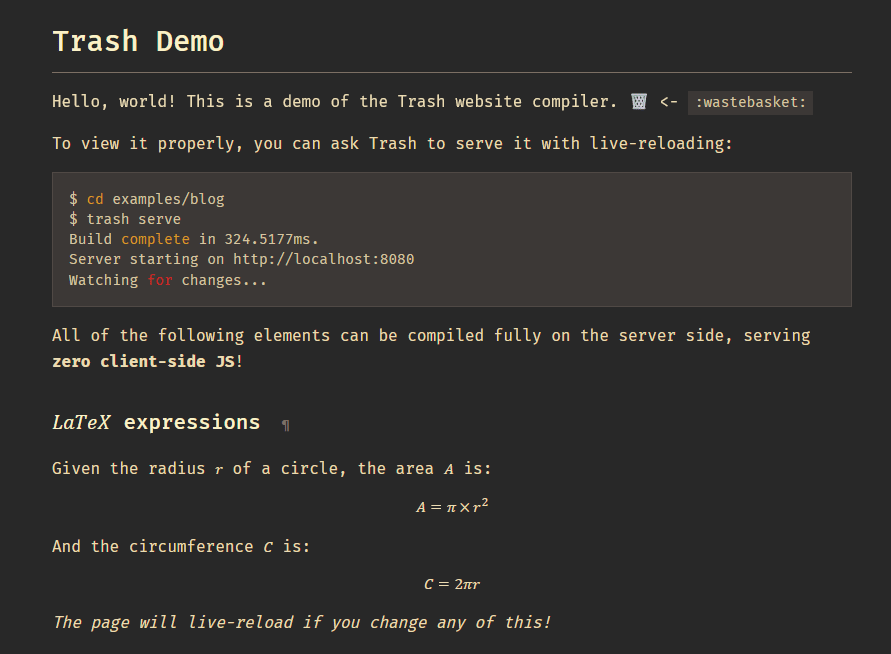
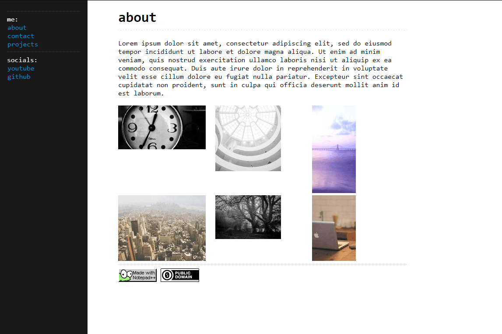

# [examples](https://zeozeozeo.github.io/trash/)

Hosted version of examples listed below: https://zeozeozeo.github.io/trash/

- [Blog example](./blog/) - A blog with a custom CSS Gruvbox theme, static content, an RSS feed and multiple layouts. Demonstrates most features of the compiler.
  
- [Personal example](./personal/) - A dummy personal homepage with a few cool quirks.
  
