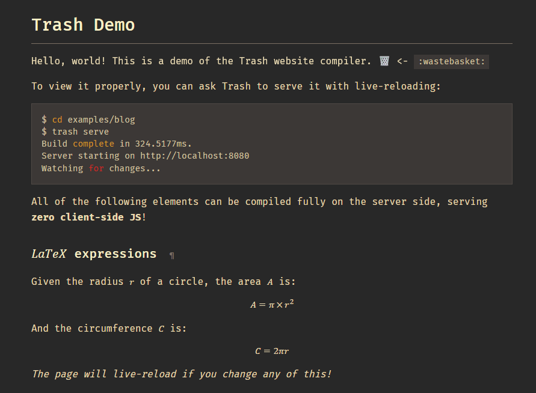

# examples/blog

A blog with a custom CSS Gruvbox theme, static content, an RSS feed and multiple layouts. This example demonstrates almost every feature of the Trash compiler.

To view this example properly, [install Trash](/README.md) and do:

```console
$ cd examples/blog
$ trash serve
Build complete in 9.6595ms.
Server starting on http://localhost:8080
Watching for changes...
```

## Screenshots




