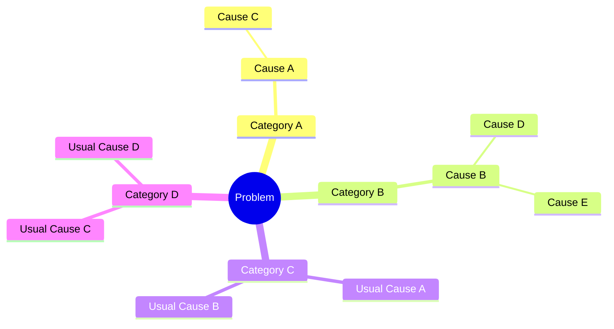

<!--
The frontmatter above can also be TOML if you enclose it in `+++` instead of `---`.
This is how you do comments in Markdown, btw. They will not appear in the compiled HTML.
-->

Hello, world! This is a demo of the Trash website compiler. :wastebasket: <- `:wastebasket:`

To view it properly, you can ask Trash to serve it with live-reloading:

```bash
$ cd examples/blog
$ trash serve
Build complete in 324.5177ms.
Server starting on http://localhost:8080
Watching for changes...
```

All of the following elements can be compiled fully on the server side, serving **zero client-side JS**!

### $LaTeX$ expressions

Given the radius $r$ of a circle, the area $A$ is:

$$
A = \pi \times r^2
$$

And the circumference $C$ is:

$$
C = 2 \pi r
$$

_The page will live-reload if you change any of this!_

### D2 diagram:

```d2
dogs -> cats -> mice: chase
replica 1 <-> replica 2
a -> b: To err is human, to moo bovine {
  source-arrowhead: 1
  target-arrowhead: * {
    shape: diamond
  }
}
```

### Mermaid Mindmap:



### Pikchr diagram:

```pikchr
arrow right 200% "Markdown" "Source"
box rad 10px "Markdown" "Formatter" "(markdown.c)" fit
arrow right 200% "HTML+SVG" "Output"
arrow <-> down 70% from last box.s
box same "Pikchr" "Formatter" "(pikchr.c)" fit
```

### Embed YouTube videos & audio files

...with native Markdown syntax!


### Syntax highlighting

[Go](https://go.dev/):

```go
func main() {
    fmt.Println("ok")
}
```

JavaScript:

```js
"b" + "a" + +"a" + "a"; // -> 'baNaNa'
```

:::{.blue}

### Life Inside Fences

This paragraph is inside a fenced block.

:::{#insideme .red data="important"}
You can nest and assign custom IDs to them.
:::
:::

### Callouts

Trash also supports [GitHub style callouts](https://github.com/orgs/community/discussions/16925):

> [!NOTE]  
> Highlights information that users should take into account, even when skimming.

TIP: Optional information to help a user be more successful.

IMPORTANT
Crucial information necessary for users to succeed.

> [!WARNING]  
> Critical content demanding immediate user attention due to potential risks.

> [!CAUTION]
> Negative potential consequences of an action.

### Image figures

This is an extension of Markdown that allows you to place `<figure>` elements by typing text below an image:

<div style="display:flex; gap:20px; align-items:center;">
  <div>


Rainbow Dash

  </div>
  <div>


Rarity

  </div>
</div>

Notice how we're appending `?w=100px` after the image URL and Trash automatically knows to make it 100px, even though the host doesn't support it:

```markdown


```

(you might remember this from [Obsidian](https://obsidian.md/))

# Other extensions

#### This is a red heading made with the CommonMark [attribute syntax](https://talk.commonmark.org/t/consistent-attribute-syntax/272) ## {.highlight-nl}

Trash fully supports all extensions of [GitHub Flavored Markdown](https://github.github.com/gfm/) (including tables, autolinks, ~~strikethrough text~~, tasklists, definition lists and footnotes):

| Pony Name        | Species    | Color Scheme    | Element    |
| :--------------- | :--------- | :-------------- | :--------- |
| Twilight Sparkle | Alicorn    | Purple / Pink   | Magic      |
| Rainbow Dash     | Pegasus    | Blue / Rainbow  | Loyalty    |
| Pinkie Pie       | Earth Pony | Pink            | Laughter   |
| Applejack        | Earth Pony | Orange / Blonde | Honesty    |
| Fluttershy       | Pegasus    | Yellow / Pink   | Kindness   |
| Rarity           | Unicorn    | White / Purple  | Generosity |

- [x] foo
  - [ ] bar
  - [x] baz
- [ ] bim

This is a test of the typographer extension -- this should've been an em dash `--`, <<this should be in quotation marks>>, "this should be in quotes" and this should be an ellipsis...

#### East Asian line breaks

小马宝莉的朋友们  
她们一起经历冒险。  
トワイライトスパークルと仲間たち  
彼女たちは友情の魔法を信じています。  
마이리틀포니 친구들  
그들은 언제나 우정을 소중히 합니다。

(Soft line breaks are rendered as a newline.)

#### Escaped space

小马宝莉\ 朋友们  
トワイライト\ スパークル  
마이리틀포니\ 친구들

(The backslashes before the spaces are rendered as visible spaces instead of collapsing.)
